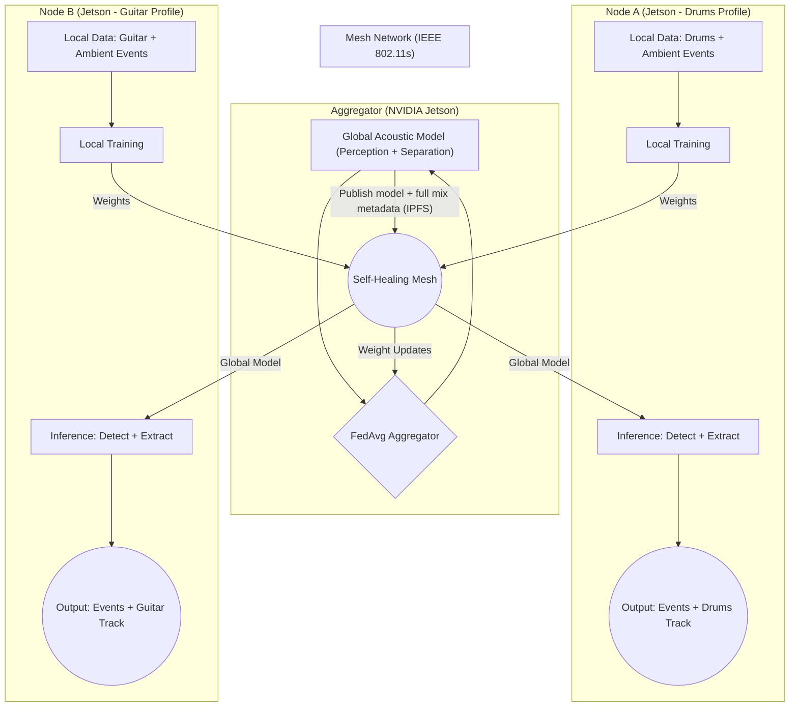
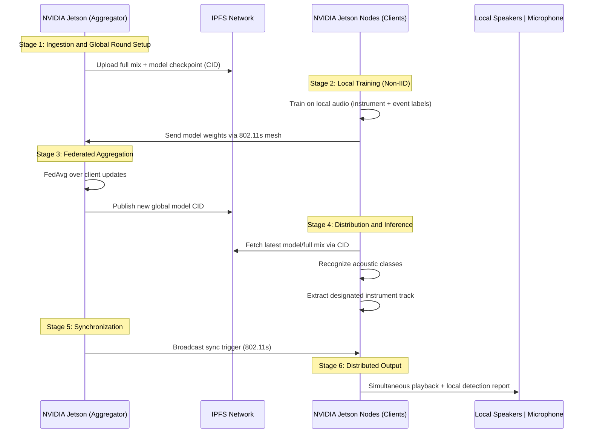

# Project Proposal: Federated Learning Acoustic Perception and Separation

**Course:** Redes e Sistemas Autónomos (RSA)
**Academic Year:** 2025/2026

---

### 1. Group Members
* **Student 1:** Rúben Gomes / 113435
* **Student 2:** Simão Almeida / 113085

### 2. Description
This project implements a decentralized acoustic intelligence system as well as a distributed source separation pipeline, where autonomous nodes collaborate to both recognize environmental sounds and isolate individual instruments from a shared audio mix. Using musical instruments as a "proxy" for real-world signals (e.g., emergency sirens or industrial failure sounds), the system demonstrates how a network can "learn" collectively without centralizing the raw data.

This then leads to two major distinct use cases: 

1. **Distributed Acoustic Perception** (sound/event recognition)
2. **Federated Source Separation** (isolating each instrument from a full mix)

The network works as an autonomous "Intelligent Orchestra + Sensor Grid" where each node learns from private, specialized, **Non-IID** audio data (e.g., drums, guitar, bass) and collaborates through **Federated Learning (FL)**.

* **The Problem:** In autonomous systems, audio data is distributed, heterogeneous, and costly to centralize. Each node may observe only part of the acoustic world.
* **The FL Solution:** Using **MobFedLS** with **Flower**, nodes train locally and share only **model updates** (weights), preserving privacy and reducing bandwidth usage.
* **Autonomous Aggregation:** Updates travel through an **IEEE 802.11s mesh network** to an **NVIDIA Jetson** that performs **FedAvg** and redistributes the improved global model.
* **Unified Capability:** After aggregation, each node can both (i) recognize the full set of acoustic classes and (ii) extract its designated instrument from a shared full mix.
* **Distribution Layer:** Audio assets and model versions are distributed via **IPFS**, enabling resilient multi-hop content delivery.

### 3. Simulation/Emulation vs. Real-World Implementation

#### Simulation/Emulation
We will use **EmuCD** to model mobility and evaluate both use cases under controlled network dynamics. The emulation will benchmark:

* FL convergence under packet loss and temporary disconnections
* Perception performance (classification accuracy/F1)
* End-to-end update latency in multi-hop mesh paths

#### Implementation
The project would be initially deployed on simualted nodes to train and validate the models, which would then result in running it on a physical cluster (NVIDIA Jetson clients and a NVIDIA Jetson aggregator) connected through **802.11s mesh mode**. 

### 4. Necessary Hardware
* **3x NVIDIA Jetson:** One serving as the **FL Aggregator**, and the other two as **FL Clients**.
* **3x Wi-Fi Adapters:** Must support **802.11s (mesh point mode)** for resilient peer-to-peer communication.
* **3x Speakers:** Used to demonstrate distributed playback after local source extraction.
* **3x USB microphones:** For local audio capture to identify what's being currently captured.

### 5. Proposal Diagram / Preliminary Demo Scheme

The diagram below illustrates the unified FL pipeline from local perception/separation training to collective global intelligence over the 802.11s mesh.

Furthermore, the sequence diagram below represents an end-to-end cycle where nodes learn collaboratively, detect acoustic classes, and perform synchronized source-separated playback.

