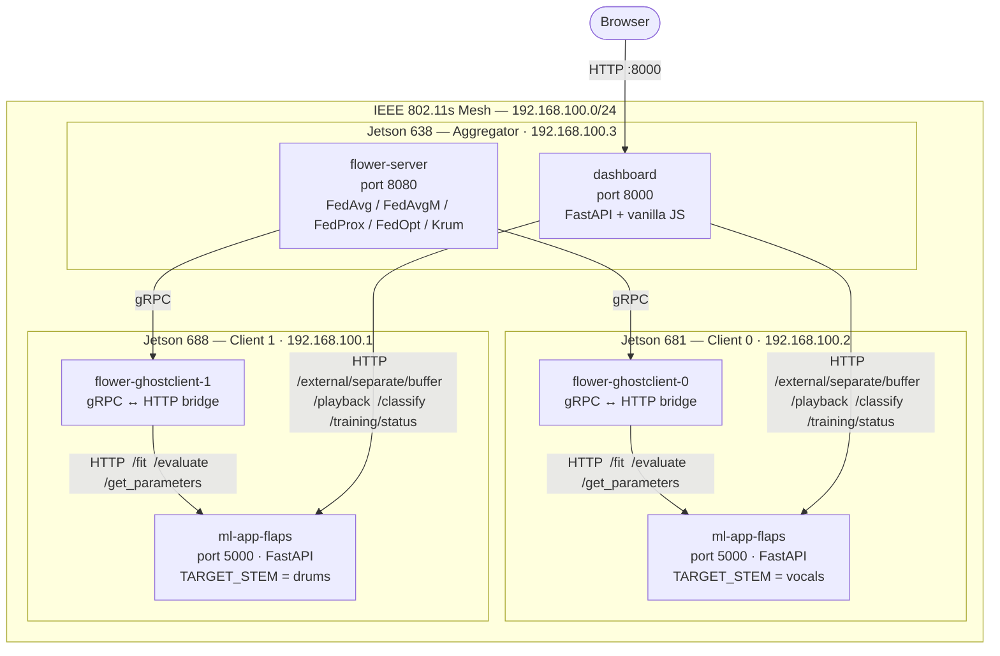
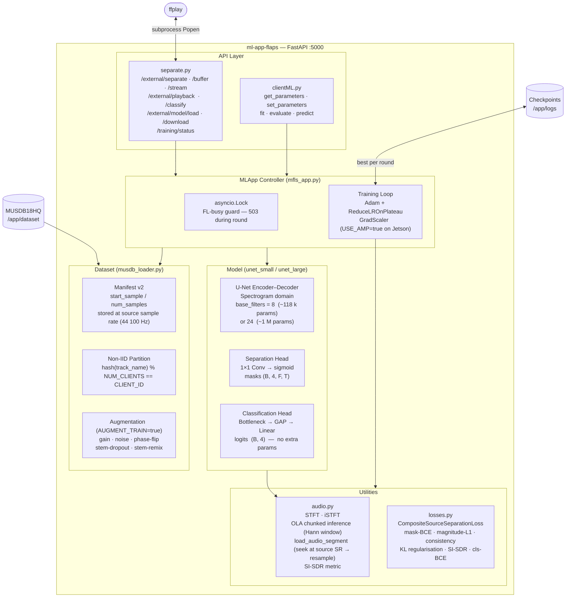
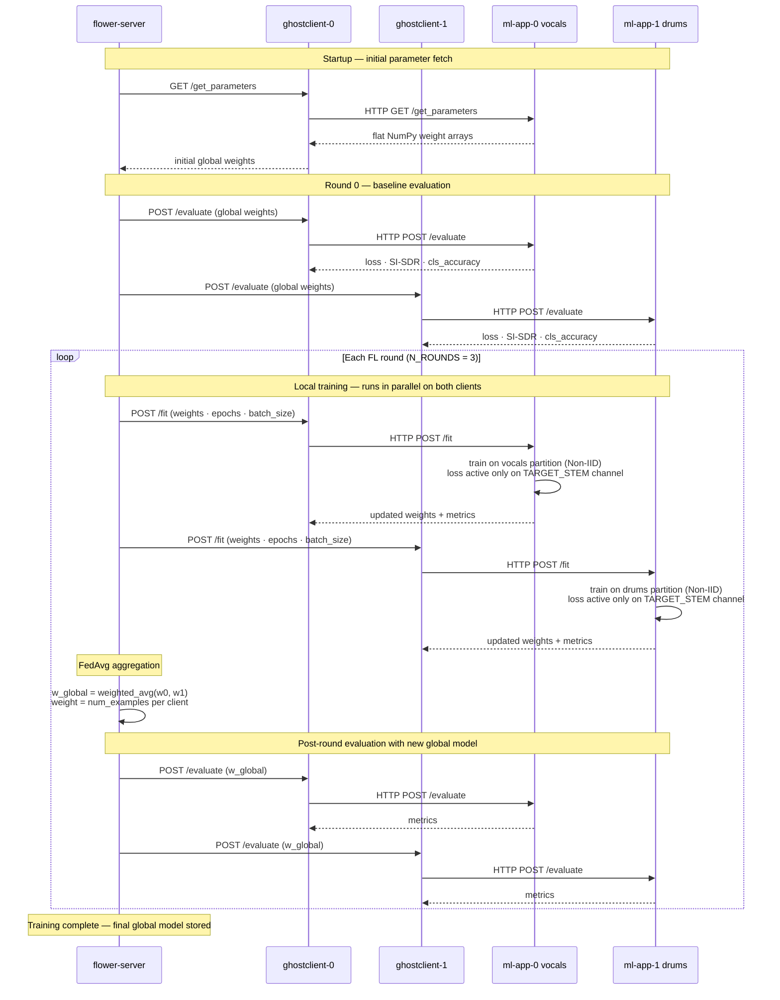
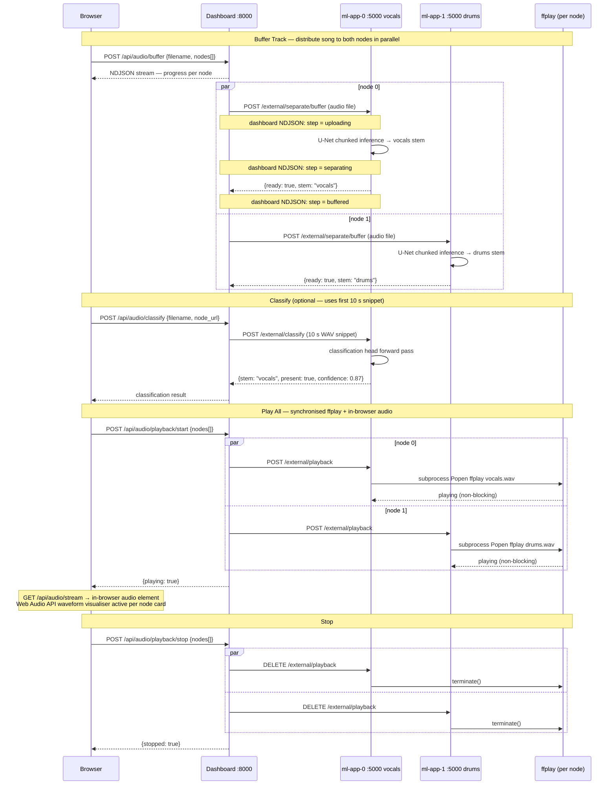

# FLAPS — Full System Architecture

Five diagrams covering the physical deployment, internal components, model pipeline, FL training round, and demo flow.

---

## 1. Physical Deployment and Communication

Three Jetson nodes on an IEEE 802.11s mesh. The aggregator runs the Flower server, two gRPC↔HTTP bridge containers, and the web dashboard. Each client runs a single ml-app container.

---

## 2. ML App Internal Components

Each client node runs `ml-app-flaps`, a FastAPI server whose internals are organised into five layers: API, controller, model, dataset, and utilities.

---

## 3. U-Net Model and Audio Pipeline

The full forward pass from raw waveform to separated stems and stem-presence classification.

```mermaid
graph LR
    MIX(["Audio Mix\nwaveform"])

    subgraph PREP["Audio Preparation"]
        OLA["OLA Chunker\nchunk = 30 s\nHann window\noverlap-add on output"]
        STFT_F["STFT\nn_fft = 512\nhop = 128\nsr = 8 000 Hz"]
        SPEC["Magnitude Spectrogram\nB × 1 × F × T"]
    end

    subgraph ENCODER["U-Net Encoder"]
        E1["Conv block 1\nConv2d + BN + ReLU\n↓ stride"]
        E2["Conv block 2"]
        EN["..."]
        BOTT["Bottleneck"]
    end

    subgraph DECODER["U-Net Decoder"]
        D1["Deconv block 1\nConvTranspose2d + skip"]
        D2["Deconv block 2"]
        DN["..."]
    end

    subgraph HEADS["Output Heads"]
        SEP["Separation Head\n1×1 Conv → sigmoid\nmasks  B × 4 × F × T"]
        CLS["Classification Head\nGAP → Linear\nlogits  B × 4"]
    end

    subgraph OUT["Output"]
        MASKED["Apply masks to mix spectrogram"]
        ISTFT_F["iSTFT + OLA accumulate"]
        STEMS(["4 separated stems\nvocals · drums · bass · other"])
        PRESENCE(["Stem presence\n{stem, present, confidence}"])
    end

    MIX --> OLA --> STFT_F --> SPEC
    SPEC --> E1 --> E2 --> EN --> BOTT
    BOTT --> D1 --> D2 --> DN --> SEP
    BOTT --> CLS
    SEP --> MASKED
    SPEC -->|mix| MASKED
    MASKED --> ISTFT_F --> STEMS
    CLS --> PRESENCE
```

---

## 4. Federated Learning Round

One complete FL cycle: initial parameter fetch, per-round local training, FedAvg aggregation, and post-round evaluation.

---

## 5. Demo Flow: Song Distribution and Synchronised Playback

Dashboard-driven flow from audio upload to distributed stem playback, including optional stem-presence classification.

