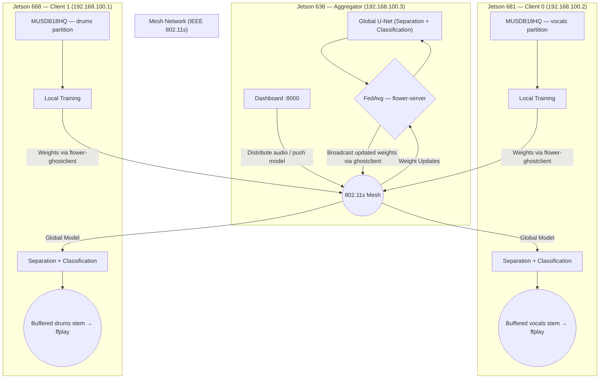
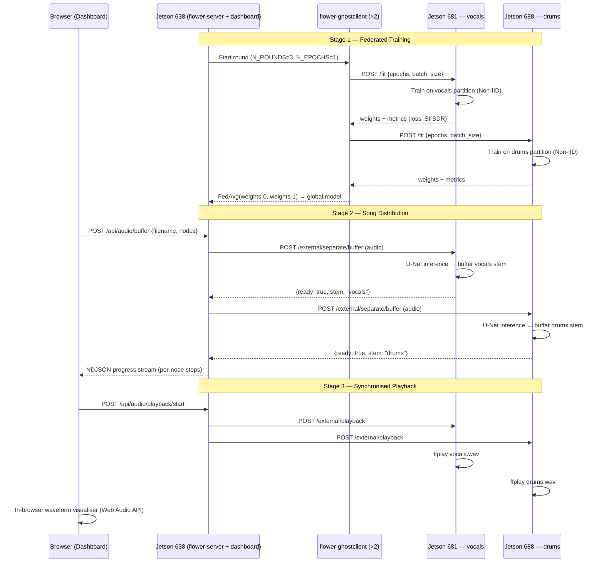

# Project Report: Federated Learning Acoustic Perception and Separation

**Course:** Redes e Sistemas Autónomos (RSA)
**Academic Year:** 2025/2026

---

### 1. Group Members
* **Student 1:** Rúben Gomes / 113435
* **Student 2:** Simão Almeida / 113085

### 2. Description

This project implements a decentralised music source separation system where autonomous edge nodes collaborate via Federated Learning to isolate individual instrument stems from a shared audio mix. Using the MUSDB18HQ dataset as a proxy for heterogeneous, distributed real-world audio data (analogous to, e.g., distributed sensor nodes capturing environmental sound), the system demonstrates how a mesh network can learn collectively without centralising raw audio.

Two integrated capabilities are provided by each node:

1. **Federated Source Separation** — isolating each node's designated instrument stem from a full mix using a spectrogram-domain U-Net trained collaboratively via FedAvg
2. **Stem Presence Classification** — detecting whether the node's assigned stem is present in an uploaded audio clip, via a lightweight classification head that shares the separation encoder at no extra parameter cost

The network operates as a distributed "Intelligent Orchestra" where each node holds private, specialised, **Non-IID** audio data (a vocals partition or a drums partition) and shares only model weight updates.

* **The Problem:** In autonomous systems, audio data is distributed, heterogeneous, and costly to centralise. Each node observes only part of the acoustic world.
* **The FL Solution:** Using **MobFedLS** with **Flower**, nodes train locally and share only **model updates** (weights), preserving privacy and reducing bandwidth usage over the mesh.
* **Autonomous Aggregation:** Updates travel through an **IEEE 802.11s mesh network** to an **NVIDIA Jetson** aggregator that runs **FedAvg** and redistributes the improved global model.
* **Unified Capability:** After aggregation, each node can both (i) classify stem presence in an uploaded clip and (ii) extract its designated stem from a shared full mix for synchronised playback.
* **Orchestration:** Audio assets and model checkpoints are managed through a web dashboard on the aggregator, which distributes songs and model files to client nodes via HTTP over the mesh and triggers synchronised playback.

### 3. Simulation/Emulation vs. Real-World Implementation

#### Simulation/Emulation

EmuCD-based benchmarking (FL convergence under controlled packet loss and disconnections) was not completed within the project timeline.

#### Implementation

The system was developed and validated using Docker Compose on a single machine, then deployed to a physical cluster: two NVIDIA Jetson client nodes and one NVIDIA Jetson aggregator, communicating over an **IEEE 802.11s mesh network**.

### 4. Hardware Used

* **3× NVIDIA Jetson:** One as the **FL Aggregator** (Jetson 638, `192.168.100.3`), two as **FL Clients** (Jetson 681, `192.168.100.2`; Jetson 688, `192.168.100.1`).
* **3× Wi-Fi Adapters:** Supporting **802.11s mesh point mode** for peer-to-peer communication.
* **Speakers:** Used to demonstrate distributed stem playback after separation (via `ffplay` on each node).

### 5. Implementation Diagrams

The diagram below illustrates the deployed FL pipeline, from local training on private audio partitions to synchronised distributed playback over the 802.11s mesh.

The sequence diagram below shows a complete end-to-end cycle: federated training, song distribution, and synchronised playback.

